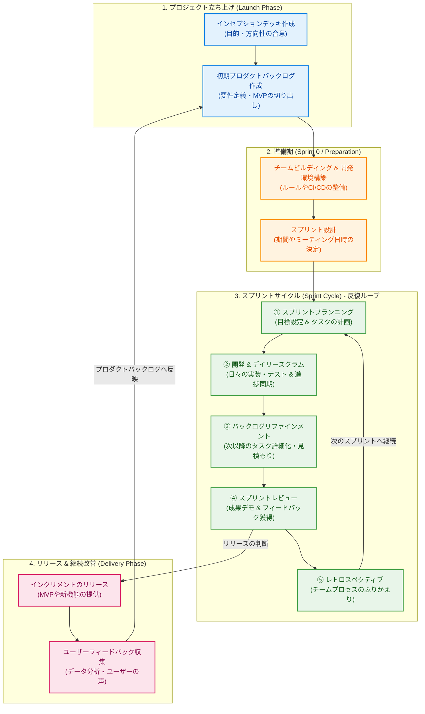

# アジャイル・スクラム開発 プロジェクト全体フロー

アジャイル開発（特にスクラム）における、プロジェクト立ち上げからスプリントの繰り返し、リリースまでの全体プロセスを示すフローチャートと各フェーズの解説です。

---

## 1. 全体プロセスのフローチャート

以下は、プロジェクト開始（立ち上げ）から開発サイクル、リリースまでの流れを示したフロー図です。

---

## 2. 各フェーズの詳細説明

### 1. プロジェクト立ち上げ (Launch Phase)
プロジェクトの「なぜやるのか（Why）」と「何を作るのか（What）」を明確にするフェーズです。
* **インセプションデッキ作成**: チームとステークホルダーが一堂に会し、プロジェクトのビジョン、目的、やらないこと（トレードオフスライダーなど）を合意します。
* **初期プロダクトバックログ作成**: ユーザーストーリー形式でやりたいことをリストアップし、優先順位をつけます。この段階で、検証すべき最小限の製品範囲である **MVP (Minimum Viable Product)** を定義します。

### 2. 準備期 (Sprint 0 / Preparation)
本格的な開発サイクルに入る前に行う、環境とルールの整備フェーズです。
* **チームビルディング & 開発環境構築**: チームの協力体制（ワーキングアグリーメント）を作り、開発用PCの設定、コードリポジトリ、CI/CD環境、本番/ステージング環境などを準備します。
* **スプリント設計**: 1スプリントの長さ（通常は1〜2週間）を決め、スプリントプランニングやデイリースクラムなどをカレンダーに設定します。

### 3. スプリントサイクル (Sprint Cycle)
アジャイル開発のエンジン部分となる、反復的（イテレーティブ）な開発期間です。
1. **スプリントプランニング**: スプリント開始時に行い、今回のスプリントで達成する「スプリントゴール」を決定し、タスクを計画します。
2. **開発 & デイリースクラム**: 毎日15分の朝会で進捗と障害を共有し、チームで密に連携しながら開発を進めます。
3. **バックログリファインメント**: 開発と並行して、プロダクトバックログの先頭にあるアイテム（次回の候補）を詳細化し、ストーリーポイントを見積もります。
4. **スプリントレビュー**: スプリントの成果物（動くソフトウェア）をデモし、ステークホルダーからフィードバックを得ます。
5. **レトロスペクティブ**: チームの動き方を振り返り、次のスプリントをより良くするための改善アクション（Try）を決定します。

### 4. リリース & 継続改善 (Delivery Phase)
スプリントレビューで承認されたインクリメント（成果物）をユーザーに届けるフェーズです。
* **インクリメントのリリース**: スプリントごとに、または準備ができた時点で都度本番環境へデプロイします。
* **ユーザーフィードバック収集**: 実際の使われ方や要望を分析し、新たなアイデアや改善点をプロダクトバックログにフィードバックします。バックログの優先順位が更新され、次のサイクルへと繋がります。
